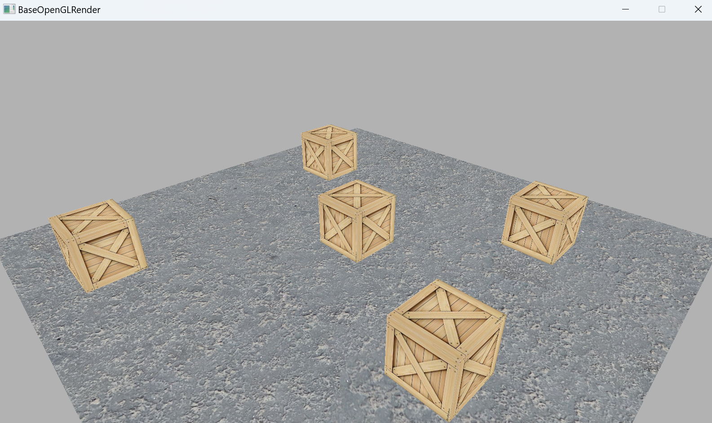
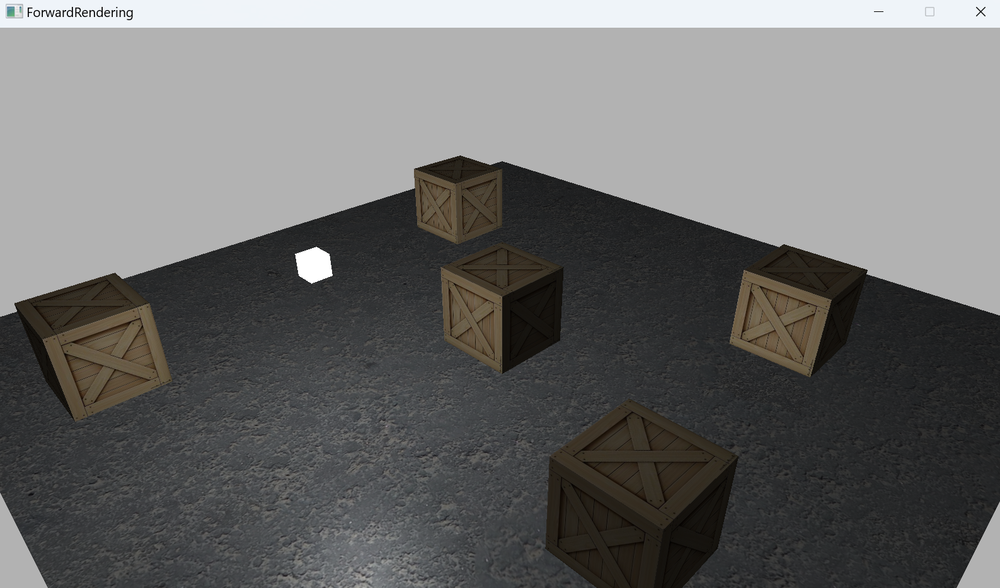
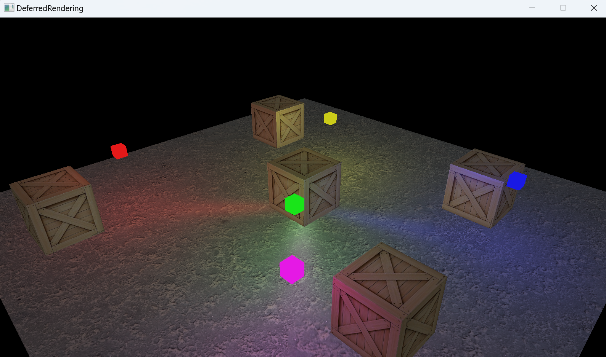
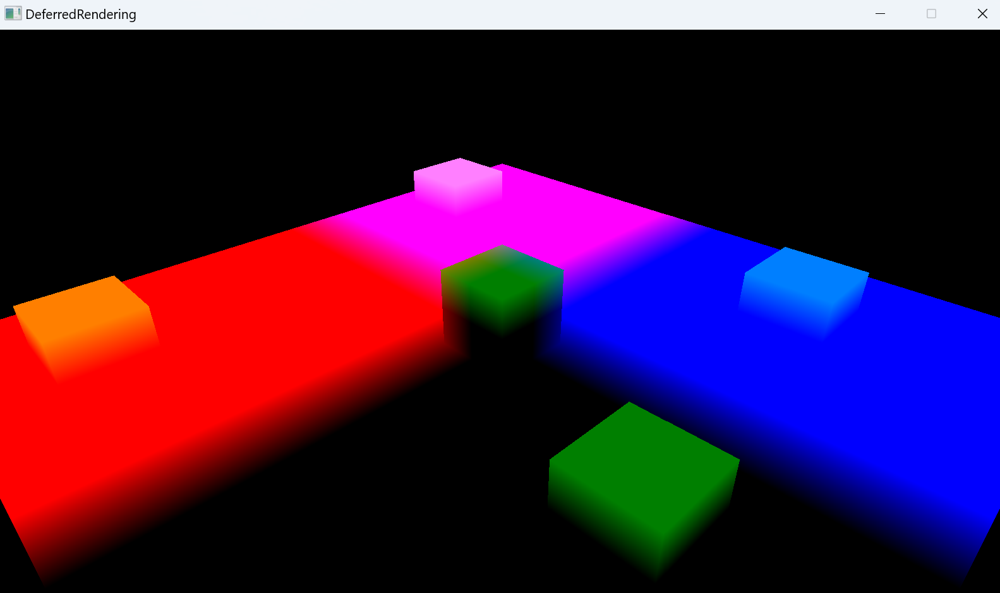
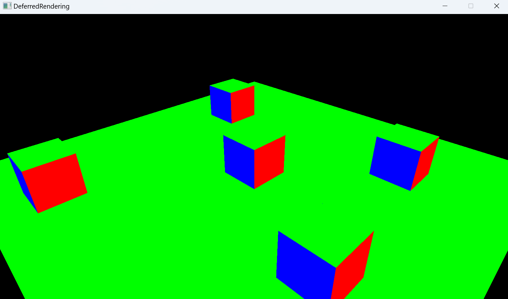
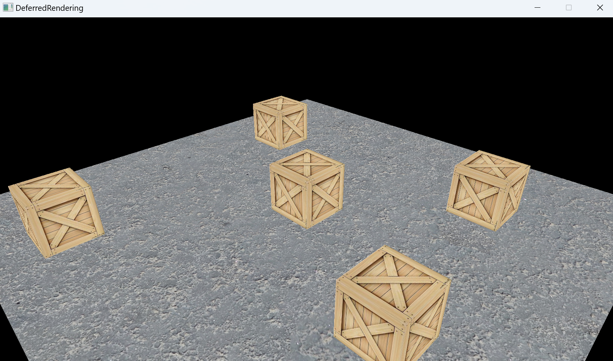

# OpenGL based on SFML

- Use SFML library to open the window, instead of glew library.
- Use glad to load OpenGL functions.
- Use glm to do the math.
- Unlit rendering, forward light rendering & deferred light rendering.

## Base unlit rendering

## Forward light rendering

## Deferred light rendering

### GBuffer content

- Position buffer

- Normal buffer

- Albedo & Specular

